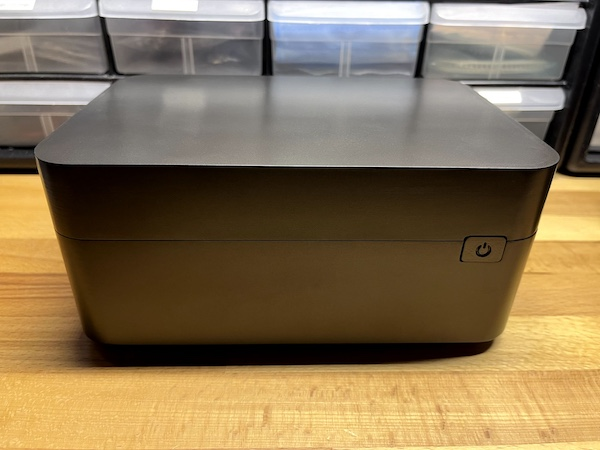

# DXP480T Custom Case

For more pictures, see: https://photos.app.goo.gl/Rahk7zdu8heuZMXZ9

## Printing & Assembly

Recommend printing case parts in ASA (to resist the hardware's high temps).  PLA or PETG should be avoided and will melt and/or distort.

To assemble ASA parts, prepare a mix of acetone and ASA scraps to make a glue.

You will also need:
* 20 x 5x2mm neodynium magnets (for the fan cover)
* 8 x M3 brass inserts (for the case halves and fan mount)
* 4 x 25mm M3 bolts (for case halves)
* 4 x 8mm M3 bolts (for fan)
* 1 x Noctua 120x25mm PWM fan (or compatible alternative)
* 1 x Noctua NA-FC1 PWM fan controller (or compatible alternative)
* 2 x 120x120mm pvc fan grille (or suitable alternative)

## NVME Mounting Bracket

To secure the NVME drives, see this repo for a 3d printable mounting bracket:
[dxp480t-nvme-bracket](https://github.com/mlilley/dxp480t-nvme-bracket)

## Fan Power

12V and ground for the 120mm fan can be obtained from the motherboard's pogo pin pads that originally connected to the factory case's uderside fans.

## Painting

To paint, I recommend spraying with a suitable primer before top coating with your chosen top coat.  I used [Mr. Finishing Surfacer 1500 Black](https://www.mr-hobby.com/en/product2/category_33/256.html) to prime, then [Gun Metal](https://www.splash-paints.com/product-page/gunmetal) from [Barbatos Rex' Mecha Empire range](https://www.splash-paints.com/barbatosrex) of anodized-look lacquers from Splash Paints.

I used an airbrush with a 0.8mm needle to get reasonable coverage over the large case parts.
